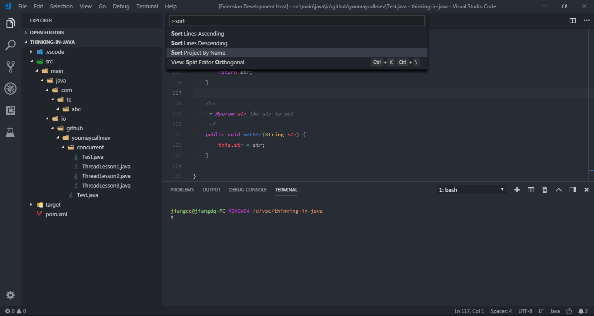
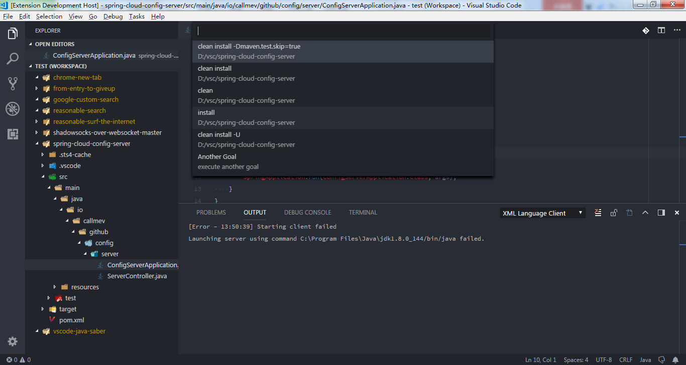
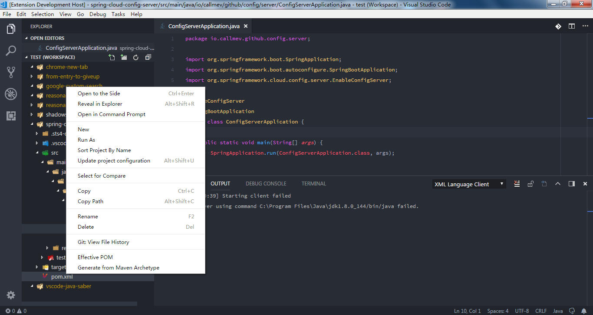
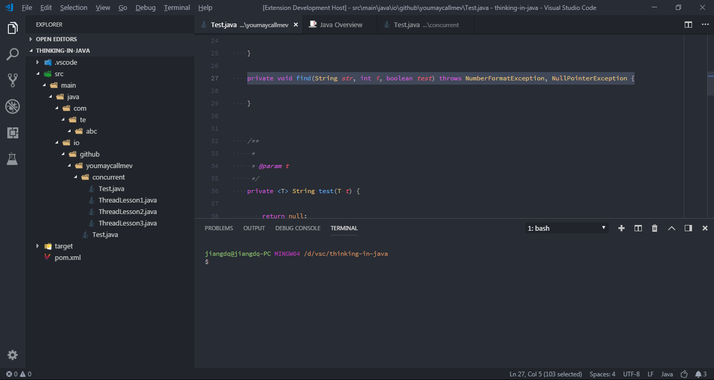

<h1 align="center">Saber for VS Code [<a href="README.md">English</a>]</h1>

    
    
    
    
    

此扩展实现了很多实用的 Java 开发功能，尽可能提高开发效率。使得 VS Code 像 Eclipse 和 IDEA 一样提供很多常用的开发功能。

# 功能特性
该插件包含的功能在一定程度可以提高开发的效率。以下是该扩展支持的功能列表：
* 创建文件（注解、类、接口、枚举、包、JSP、HTML）
* 生成 get 和 set 方法
* 复制类路径
* 按工程名排序
* 执行 Maven
* 生成文档注释

其他准备加入的功能：
* 重命名 Java 文件

# 环境准备
* JDK 1.8 及以上
* VS Code 1.19 及以上

# 安装
通过[扩展商城](https://marketplace.visualstudio.com/)进行安装，输入："vscode-java-saber" "Java IDE" 进行查找

# 使用
__PS：该扩展的大多数功能是通过解析字符串来实现的。因此，确保你的代码尽可能符合规范。__

## 创建文件
* __方法一__：在左侧的项目列表浏览器中，右键单击需要创建 java 文件位置（文件或者目录）

* __方法二__：当前编辑器中必须打开 Java 文件 => ctrl + shift + p => 输入：java new

则会在当前打开的编辑器文件的相同目录下创建 Java 文件.

## 生成 get 和 set 方法
__已知问题：当类中定义了内部类时，生成 getters、setters 会出现问题__
* __方法一__：右键单击需要生成 get 和 set 方法的文件

* __方法二__：当前编辑器中必须打开 Java 文件 => ctrl + shift + p => 输入：getter setter

* __方法三__：使用快捷键 'alt + insert'

## 复制类路径
* __方法一__：在左侧的项目列表浏览器中，右键单击需要复制类路径的 Java 文件

* __方法二__：当前编辑器中必须打开 Java 文件 => ctrl + shift + p => 输入：copy qualified name

* __方法三__：在打开的的类文件右击

## 按工程名排序
编辑配置 "ide.projectAutoSort" 为 true，当添加项目的时候会自动排序，默认为 false

* __方法一__：右键左侧工程浏览框

* __方法二__：ctrl + shift + p => 输入：Sort Project By Name

## 执行Maven
编辑配置 "ide.mavenDefaultGoals" 为常用的 maven 指令，默认为 "clean install -Dmaven.test.skip=true" 和 "clean install"

* __方法一__：在 pom.xml 右键

## 生成文档
* __方法一__：
1. 选择需要生成文档的代码，如下图

2. 在类文件的编辑器中单击右键或者使用快捷键'alt + i'

# 问题和反馈
在 [Issue Tracker](https://github.com/jiangdequan/vscode-java-saber/issues) 你可以看到所有的 Issue。你也可以通过 [bug or feature suggestion](https://github.com/jiangdequan/vscode-java-saber/issues/new) 反馈问题和建议。

# 许可证
Dual-licensed under [BSD 2-Clause License](http://opensource.org/licenses/BSD-2-Clause) and [GPLv2 with the Classpath Exception](http://openjdk.java.net/legal/gplv2+ce.html).